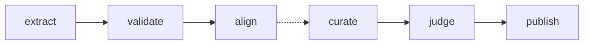

# IBrary

UDL-aligned **biology** content pipeline: extract [OpenStax Biology 2e](https://openstax.org/details/books/biology-2e), align it with structured Nigerian curriculum JSON (SSS 1 focus), optionally generate accessible learning modules via OpenAI (RAG), and publish reviewed content to DynamoDB. Storage is **PostgreSQL + pgvector** for chunks and embeddings; **DynamoDB** (and optional **S3** for images) for serving.

## What this repo implements

- **Extract & load** — Parse `Biology2e-WEB.pdf`, structured chunks and images → Postgres ([`textbook/openstax_biology2e.py`](src/ibrary/textbook/openstax_biology2e.py), [`textbook/loader.py`](src/ibrary/textbook/loader.py)).
- **Validate** — Curriculum JSON and unit IDs ([`curriculum/`](src/ibrary/curriculum/)).
- **Align** — Embed chunks, similarity search vs curriculum ([`alignment/`](src/ibrary/alignment/)).
- **Filter relevance** (pipeline v2) — LLM gate on aligned chunks before curation ([`relevance/`](src/ibrary/relevance/)).
- **Optional (LLM-dependent)** — UDL curation with textbook figure linking, judge scoring, DynamoDB publish ([`curation/`](src/ibrary/curation/), [`enrichment/`](src/ibrary/enrichment/), [`judging/`](src/ibrary/judging/), [`serving/`](src/ibrary/serving/)).

**Roadmap (not implemented here):** additional subjects (chemistry, physics), non-OpenAI LLM providers, and broader “profile-based” transformation APIs described in older design docs.

## Documentation

**Full setup (Docker, Postgres, env vars, textbook download, troubleshooting):** see [SETUP.md](SETUP.md).

**Reviewer portal (planned):** [docs/plans/2026-05-16-reviewer-portal.md](docs/plans/2026-05-16-reviewer-portal.md) · **AWS / Terraform:** [infra/README.md](infra/README.md)

## Quick start

```bash
git clone <repository-url>
cd IBrary   # or your clone directory name

uv sync --extra dev
uv pip install -e .
cp .env.example .env
# Set OPENAI_API_KEY (required for default pipeline: embeddings in align)
# Set DATABASE_URL if not using defaults (see SETUP.md)

# Start Postgres + DynamoDB Local (see SETUP.md for Windows vs make)
make up   # Windows PowerShell: .\scripts\make.ps1 up

uv run alembic upgrade head
uv run python scripts/create_dynamodb_tables.py

make download-textbook   # OpenStax Biology 2e PDF into data/docs/...
# Windows: .\scripts\make.ps1 download-textbook

# Default: extract → validate → align (no LLM curation)
make pipeline
# Windows PowerShell: .\scripts\make.ps1 pipeline
# Git Bash on Windows: powershell -File scripts/make.ps1 pipeline
# or anywhere: uv run python scripts/run_pipeline.py

# Pipeline v2 (recommended): adds filter_relevance + excerpt-based curation + media linking
uv run python scripts/run_pipeline.py --pipeline-version 2

# Optional: full flow through curation, judge, publish
make pipeline-full
# Windows: .\scripts\make.ps1 pipeline-full
# or: uv run python scripts/run_pipeline.py --full --pipeline-version 2
```

More options: `python scripts/run_pipeline.py --help` (e.g. `--steps extract`, `--full --resume-from curate`). Notebook mirror: [`notebooks/run_pipeline.ipynb`](notebooks/run_pipeline.ipynb).

## Project structure

```
IBrary/
├── src/ibrary/
│   ├── config.py           # Environment-based settings
│   ├── db.py               # SQLAlchemy engine/session
│   ├── models.py           # Textbook, chunks, embeddings, curated content, …
│   ├── curriculum/         # Curriculum validation & schemas
│   ├── textbook/           # OpenStax Biology 2e PDF extract + DB load
│   ├── alignment/          # OpenAI embeddings + pgvector alignment
│   ├── relevance/          # Chunk relevance filter (pipeline v2)
│   ├── curation/           # RAG + UDL prompts → curated modules
│   ├── enrichment/         # Textbook image linking (media linker)
│   ├── judging/            # UDL subtopic judge
│   └── serving/            # DynamoDB writer + FastAPI read API
├── scripts/                # run_pipeline.py, compose helpers, …
├── alembic/                # Migrations (schema `ibrary`)
├── data/docs/              # PDF, curriculum JSON, pipeline outputs (large assets often gitignored)
├── notebooks/              # Notebook pipeline walkthrough
├── tests/
├── pyproject.toml
├── SETUP.md
└── README.md
```

## Pipeline (high level)



Solid path: **default** `make pipeline`. Dotted path: **optional** `make pipeline-full` or `--steps curate,judge,publish`.

**Pipeline v2** adds `filter_relevance` to the default setup path and uses aligned excerpts + optional textbook figures during curation. Set `--pipeline-version 2` or `PIPELINE_VERSION=2` in `.env`. Details: [SETUP.md](SETUP.md) §9.

## Curated lessons and textbook images

After **curate** (v2), each curriculum unit is a JSON object in `data/docs/extracted_source_content/biology/curated_content.json` (and mirrored in Postgres `ibrary.curated_content`).

| Field | Role |
|--------|------|
| `curated_content` | Student lesson as **Markdown prose only** — headings, explanations, review questions. No `` image tags. |
| `images` | Separate list of textbook figures: `image_id`, `s3_url`, `caption`, `alt_text`. |

**Extract** uploads OpenStax figures to S3 (`s3://{bucket}/{subject}/textbook-images/…`) and records them in `textbook_images` + `textbook_image_manifest.json`. **Curate** may request figures via internal `image_placeholders`; the **media linker** picks real assets from aligned chunks and attaches them to `images[]`. Placeholders are not exported in the JSON file.

### Lesson figure numbers vs textbook captions

These are **two different numbering systems** and are **not linked** in stored data today:

- **In `curated_content`** — the LLM may write pedagogical labels such as “(Figure 1)” or describe an imagined diagram (“a plate with seven labels…”). That is lesson-local numbering for the narrative.
- **In `images[].caption`** — OpenStax labels are preserved from the PDF, e.g. `FIGURE 34.1` (chapter 34, figure 1 in the textbook).

Do **not** assume `images[0]` matches “Figure 1” in the markdown. Array order follows media-linker selections from aligned chapter chunks, not renumbered lesson figures. A lesson “Figure 1” can describe a diagram that does not exist in `images[]` at all.

**Building a UI today:** render `curated_content` as markdown; show `images[]` in a figures panel, carousel, or appendix using `s3_url` + `alt_text` / `caption`. Inline placement after specific headings is not stored yet.

Example (abbreviated) from unit `bio_sss1_theme2_topic2_content1`:

```json
{
  "curriculum_unit_id": "bio_sss1_theme2_topic2_content1",
  "title": "Food Substances in Animal Nutrition",
  "curated_content": "## Types of food substances\n\nImagine a simple picture (Figure 1) showing a plate…",
  "images": [
    {
      "image_id": "bio2e_ch34_pg1004_img0",
      "s3_url": "s3://ibrary-content/biology/textbook-images/bio2e_ch34_pg1004_img0.jpeg",
      "caption": "FIGURE 34.1 For humans, fruits and vegetables…",
      "alt_text": "Figure 34.1: Fruits and vegetables…"
    }
  ]
}
```

Postgres stores images as a JSON object `{"images": [...], "formulas": [...]}` — query with `c.images::jsonb -> 'images'`, not `jsonb_array_length(c.images)`.

If S3 paths change after curation, run `uv run python scripts/fix_curated_image_urls.py` to sync URLs from the manifest. More detail: [SETUP.md](SETUP.md) §9 (pipeline outputs and inspection).

## Prerequisites (summary)

- Python 3.10+, [uv](https://github.com/astral-sh/uv), Git  
- Docker (Postgres with pgvector + DynamoDB Local)  
- `OPENAI_API_KEY` for embeddings and (if used) curation  
- Optional: `python -m spacy download en_core_web_sm` if you use Spacy-based tooling (see [SETUP.md](SETUP.md))

## Development

```bash
uv run pytest
uv run pre-commit install
uv run pre-commit run --all-files
uv run ruff check src tests
uv run mypy src
```

Formatting: this repo may use **black** / **isort** / **ruff format** per `pyproject.toml` and pre-commit; see [SETUP.md](SETUP.md) §11–12.

## Internal API (optional)

Read API over DynamoDB (requires API key). Example:

```bash
uvicorn ibrary.serving.api:app --reload --port 8080
```

Endpoints and headers: [SETUP.md](SETUP.md) §10.

## License

MIT
