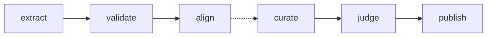

# IBrary

UDL-aligned **biology** content pipeline: extract [OpenStax Biology 2e](https://openstax.org/details/books/biology-2e), align it with structured Nigerian curriculum JSON (SSS 1 focus), optionally generate accessible learning modules via OpenAI (RAG), and publish reviewed content to DynamoDB. Storage is **PostgreSQL + pgvector** for chunks and embeddings; **DynamoDB** (and optional **S3** for images) for serving.

## What this repo implements

- **Extract & load** — Parse `Biology2e-WEB.pdf`, structured chunks and images → Postgres ([`textbook/openstax_biology2e.py`](src/ibrary/textbook/openstax_biology2e.py), [`textbook/loader.py`](src/ibrary/textbook/loader.py)).
- **Validate** — Curriculum JSON and unit IDs ([`curriculum/`](src/ibrary/curriculum/)).
- **Align** — Embed chunks, similarity search vs curriculum ([`alignment/`](src/ibrary/alignment/)).
- **Optional (LLM-dependent)** — UDL curation, judge scoring, DynamoDB publish ([`curation/`](src/ibrary/curation/), [`evaluation/`](src/ibrary/evaluation/), [`serving/`](src/ibrary/serving/)).

**Roadmap (not implemented here):** additional subjects (chemistry, physics), non-OpenAI LLM providers, and broader “profile-based” transformation APIs described in older design docs.

## Documentation

**Full setup (Docker, Postgres, env vars, textbook download, troubleshooting):** see [SETUP.md](SETUP.md).

## Quick start

```bash
git clone <repository-url>
cd IBrary   # or your clone directory name

uv sync --extra dev
uv pip install -e .
cp .env.example .env
# Set OPENAI_API_KEY (required for default pipeline: embeddings in align)
# Set DATABASE_URL if not using defaults (see SETUP.md)

# Start Postgres + DynamoDB Local (see SETUP.md for Windows vs make)
make up   # Windows PowerShell: .\scripts\make.ps1 up

uv run alembic upgrade head
uv run python scripts/create_dynamodb_tables.py

make download-textbook   # OpenStax Biology 2e PDF into data/docs/...
# Windows: .\scripts\make.ps1 download-textbook

# Default: extract → validate → align (no LLM curation)
make pipeline
# Windows PowerShell: .\scripts\make.ps1 pipeline
# Git Bash on Windows: powershell -File scripts/make.ps1 pipeline
# or anywhere: uv run python scripts/run_pipeline.py

# Optional: full flow through curation, judge, publish
make pipeline-full
# Windows: .\scripts\make.ps1 pipeline-full
# or: uv run python scripts/run_pipeline.py --full
```

More options: `python scripts/run_pipeline.py --help` (e.g. `--steps extract`, `--full --resume-from curate`). Notebook mirror: [`notebooks/run_pipeline.ipynb`](notebooks/run_pipeline.ipynb).

## Project structure

```
IBrary/
├── src/ibrary/
│   ├── config.py           # Environment-based settings
│   ├── db.py               # SQLAlchemy engine/session
│   ├── models.py           # Textbook, chunks, embeddings, curated content, …
│   ├── curriculum/         # Curriculum validation & schemas
│   ├── textbook/           # OpenStax Biology 2e PDF extract + DB load
│   ├── alignment/          # OpenAI embeddings + pgvector alignment
│   ├── curation/           # RAG + UDL prompts → curated modules
│   ├── evaluation/         # UDL judge
│   └── serving/            # DynamoDB writer + FastAPI read API
├── scripts/                # run_pipeline.py, compose helpers, …
├── alembic/                # Migrations (schema `ibrary`)
├── data/docs/              # PDF, curriculum JSON, pipeline outputs (large assets often gitignored)
├── notebooks/              # Notebook pipeline walkthrough
├── tests/
├── pyproject.toml
├── SETUP.md
└── README.md
```

## Pipeline (high level)



Solid path: **default** `make pipeline`. Dotted path: **optional** `make pipeline-full` or `--steps curate,judge,publish`.

## Prerequisites (summary)

- Python 3.10+, [uv](https://github.com/astral-sh/uv), Git  
- Docker (Postgres with pgvector + DynamoDB Local)  
- `OPENAI_API_KEY` for embeddings and (if used) curation  
- Optional: `python -m spacy download en_core_web_sm` if you use Spacy-based tooling (see [SETUP.md](SETUP.md))

## Development

```bash
uv run pytest
uv run pre-commit install
uv run pre-commit run --all-files
uv run ruff check src tests
uv run mypy src
```

Formatting: this repo may use **black** / **isort** / **ruff format** per `pyproject.toml` and pre-commit; see [SETUP.md](SETUP.md) §11–12.

## Internal API (optional)

Read API over DynamoDB (requires API key). Example:

```bash
uvicorn ibrary.serving.api:app --reload --port 8080
```

Endpoints and headers: [SETUP.md](SETUP.md) §10.

## License

MIT
