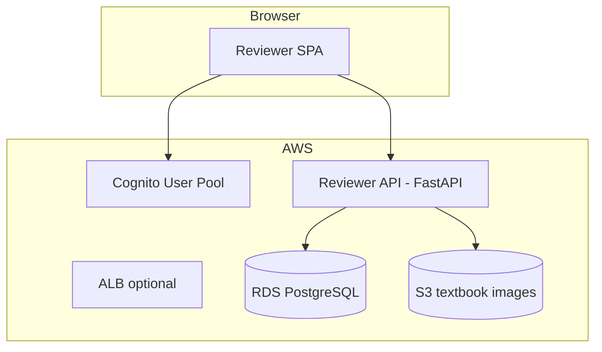

# Reviewer portal — implementation plan

**Branch:** `feature/reviewer-portal` (from `biology-multi-agent`)  
**Date:** 2026-05-16  
**Goal:** Let reviewers sign in, browse curated lessons, read UDL judge reports, and update review status in Postgres (then publish verified units to DynamoDB).

---

## What you asked for (two steps)

| Step | What | Status today |
|------|------|----------------|
| **1** | Load curated content (and judge results) into PostgreSQL | **Mostly done** — curation/judge pipeline upserts per unit; you may need a **one-shot bulk load** from JSON files |
| **2** | Web UI for reviewers: login, read content, see judge report, change `status` | **Not built** — schema and Postgres tables exist; need API + frontend + AWS auth |

---

## What already exists in the codebase

### PostgreSQL (`ibrary` schema)

| Table | Purpose |
|-------|---------|
| `curated_content` | Lesson markdown, metadata, `status`, `images` JSON |
| `content_udl_scores` | Automated judge: `overall_score`, `scores` JSON (checkpoints, recommendations, pass/fail) |
| `content_manual_quality_check` | Optional human scores/notes (can extend for reviewer comments) |

### Status workflow (today)

| `status` value | Meaning |
|----------------|---------|
| `draft` | Default after curation |
| `draft_curriculum_only` | Curated without textbook excerpts (v2 fallback) |
| `verified` | Human approved — **eligible for DynamoDB publish** |
| `published` | Also eligible for DynamoDB publish |

`publish` step only writes modules with `status` in `{verified, published}`.

### Code you can reuse

- `upsert_curated_payloads()` — [`src/ibrary/curation/curated_postgres.py`](../../src/ibrary/curation/curated_postgres.py)
- `upsert_judge_result()` — [`src/ibrary/judging/judge_postgres.py`](../../src/ibrary/judging/judge_postgres.py)
- `iter_curated_modules_from_postgres()` — list modules for API
- Existing read API (DynamoDB only): [`src/ibrary/serving/api.py`](../../src/ibrary/serving/api.py) — **not** suitable for review; build a new **Postgres-backed** API

---

## Step 1 — Load curated content into Postgres

### Option A — Already ran pipeline v2 curate/judge

If you ran:

```bash
python scripts/run_pipeline.py --pipeline-version 2 --steps curate,judge
```

each unit was upserted to Postgres as it completed. Verify:

```sql
SELECT COUNT(*) FROM ibrary.curated_content;
SELECT COUNT(*) FROM ibrary.content_udl_scores;
```

### Option B — Bulk load from JSON files

Use the loader script (added on this branch):

```bash
uv run python scripts/load_curated_to_postgres.py
# or explicit paths:
uv run python scripts/load_curated_to_postgres.py \
  --curated data/docs/extracted_source_content/biology/curated_content.json \
  --judgments data/docs/extracted_source_content/biology/udl_subtopic_evaluation.json
```

Flags:

- `--curated-only` — skip judge file
- `--judgments-only` — skip curated file
- `--dry-run` — parse and count only

**Order:** load curated first (judge rows FK to `curriculum_unit_id`).

---

## Step 2 — Reviewer web application (build)

### Recommended architecture (MVP)



**Local dev (phase 0):** FastAPI + Postgres from Docker Compose; auth via HTTP Basic or a dev API key (no Cognito yet).

**Production (phase 1):** Amazon Cognito (reviewer users) + JWT validation in FastAPI + RDS in same VPC + presigned S3 URLs for images.

### Backend — new package `src/ibrary/review/`

| Module | Responsibility |
|--------|----------------|
| `api.py` | FastAPI app: list units, get unit detail, patch status, get judge report |
| `schemas.py` | Request/response models |
| `service.py` | Join `curated_content` + `content_udl_scores`; map judge JSON to UI DTO |
| `auth.py` | Cognito JWT (prod) / dev bypass |

**API sketch**

| Method | Path | Auth | Description |
|--------|------|------|-------------|
| `GET` | `/review/units` | reviewer | Paginated list: `curriculum_unit_id`, title, theme, topic, `status`, `overall_score`, `passed` |
| `GET` | `/review/units/{id}` | reviewer | Full module: markdown, images (with presigned URLs), metadata |
| `GET` | `/review/units/{id}/judge` | reviewer | Judge report from `content_udl_scores.scores` |
| `PATCH` | `/review/units/{id}/status` | reviewer | Body: `{ "status": "verified" \| "draft" \| ... }` |
| `POST` | `/review/units/{id}/notes` | reviewer | Optional: insert `content_manual_quality_check` |

**Image URLs:** convert `s3://ibrary-content/biology/...` to short-lived HTTPS presigned URLs in the API (never expose raw keys to the browser for writes).

### Frontend — new `review-ui/` (or `apps/reviewer/`)

| Screen | Content |
|--------|---------|
| Login | Cognito Hosted UI or email/password |
| Queue | Table: unit id, title, status, judge score, pass/fail, filter by theme/topic/status |
| Review | Split view: rendered markdown + figure gallery; sidebar = judge checkpoints, recommendations, correctness/clarity notes |
| Actions | Buttons: **Approve** (`verified`), **Send back to draft**, optional notes |

**Stack suggestion:** React + Vite + TypeScript, or plain HTMX if you want minimal JS. Use `react-markdown` for lesson body.

### Status update rules

1. Reviewer sets `status` → `verified` (or back to `draft`).
2. API updates `curated_content.status` and `updated_at`.
3. Optional: append row to `content_manual_quality_check` with `checked_by` (Cognito `sub` / email).
4. **Publish** remains a separate pipeline step: `python scripts/run_pipeline.py --steps publish` (only verified/published).

### Judge report UI fields (from `content_udl_scores.scores`)

Display:

- `overall_score`, `passed`
- `representation_score`, `engagement_score`, `action_expression_score`
- `correctness_score`, `correctness_notes`, `clarity_score`, `clarity_notes`
- `checkpoint_scores[]` — table: checkpoint_id, principle, score, notes
- `recommendations[]` — bullet list

---

## Implementation phases

### Phase 0 — Local (1–2 days)

- [ ] `scripts/load_curated_to_postgres.py` (this branch)
- [ ] `src/ibrary/review/api.py` with dev API key
- [ ] Minimal HTML or React page calling localhost API
- [ ] Manual test: list → open unit → see judge → set `verified`

### Phase 1 — AWS dev environment

- [ ] Apply Terraform in `infra/terraform/environments/dev` (see [infra/README.md](../../infra/README.md))
- [ ] RDS Postgres; migrate with Alembic; load data
- [ ] Cognito user pool + test reviewer user
- [ ] Deploy API (ECS Fargate or App Runner)
- [ ] Build & deploy static UI (S3 + CloudFront or serve from API)

### Phase 2 — Hardening

- [ ] Audit log (who changed status when)
- [ ] Role groups: reviewer vs admin
- [ ] CI: deploy on merge to `feature/reviewer-portal`
- [ ] Wire publish webhook or button “Publish verified to DynamoDB”

---

## AWS setup (summary)

Full instructions: **[infra/README.md](../../infra/README.md)** and **[infra/terraform/README.md](../../infra/terraform/README.md)**.

| Service | Use |
|---------|-----|
| **RDS PostgreSQL** | Same schema as local (`ibrary`); pipeline + reviewer API |
| **Cognito** | Reviewer login |
| **S3** | Existing `ibrary-content` bucket for textbook images; optional bucket for UI static assets |
| **Secrets Manager** | `DATABASE_URL`, optional OpenAI key for re-judge |
| **ECS Fargate / App Runner** | Host reviewer API |
| **ALB + ACM** | HTTPS for API and UI (production) |
| **IAM** | Task role: RDS (via secret), S3 read for presigned URLs, Cognito read |

**Region:** align with existing bucket (e.g. `eu-west-1`).

**Cost-conscious dev:** keep Postgres on Docker locally; only provision Cognito + S3 + App Runner for a hosted demo.

---

## Security checklist

- [ ] No public Postgres port; RDS in private subnets
- [ ] Cognito JWT on all `/review/*` routes (except health)
- [ ] CORS restricted to reviewer UI origin
- [ ] Presigned S3 URLs: 15-minute expiry, read-only
- [ ] Reviewers cannot call OpenAI or pipeline admin endpoints from this app

---

## Files to add (this epic)

```
scripts/load_curated_to_postgres.py
src/ibrary/review/
  __init__.py
  api.py
  schemas.py
  service.py
  auth.py
review-ui/                    # or apps/reviewer/
infra/
  README.md
  terraform/
    README.md
    environments/dev/
    modules/cognito/
    modules/rds/
    modules/reviewer_api/     # optional phase 1
```

---

## Open decisions (confirm before Phase 1)

1. **Hosting:** App Runner (simpler) vs ECS Fargate (more control)?
2. **UI:** separate SPA repo folder vs server-rendered Jinja templates?
3. **Statuses:** add `rejected` / `in_review` or keep `draft` / `verified` / `published` only?
4. **RDS:** new instance vs connect reviewer API to existing Postgres (VPN/bastion)?

---

## Related docs

- [README.md](../../README.md) — curated lessons & images
- [SETUP.md](../../SETUP.md) — pipeline outputs & Postgres queries
- [REVIEW_PIPELINE_V2.md](../REVIEW_PIPELINE_V2.md) — manual QA of curation quality
