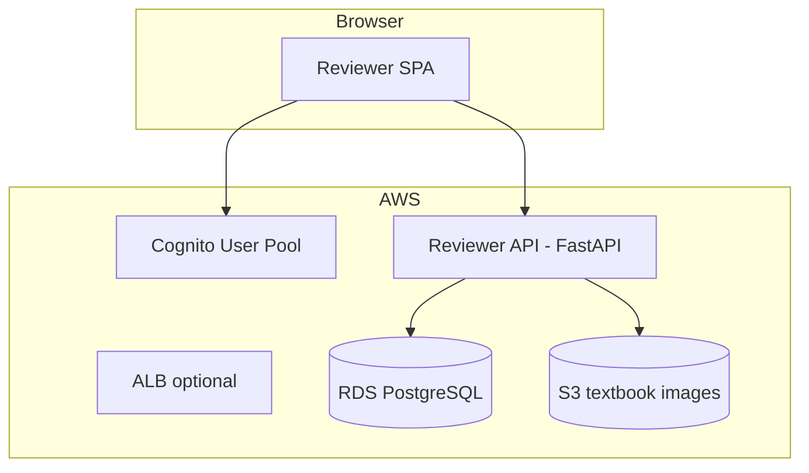

# Reviewer portal — implementation plan

**Branch:** `feature/reviewer-portal` (from `biology-multi-agent`)  
**Date:** 2026-05-16 (revised 2026-05-17 after decision log)  
**Goal:** Let reviewers sign in, browse curated lessons, read UDL judge reports, and update review status in Postgres (then publish verified units to DynamoDB).

> **Decision log:** all hosting/auth/workflow decisions are recorded in [infra/HOSTING.md § Decisions log](../../infra/HOSTING.md#decisions-log-2026-05-17). This plan is the build-order companion to that log.

---

## What you asked for (two steps)

| Step | What | Status |
|------|------|--------|
| **1** | Load curated content (and judge results) into PostgreSQL | **Done** — pipeline upserts per unit; `scripts/load_curated_to_postgres.py` available for bulk loads from JSON |
| **2** | Web UI for reviewers: login, read content, see judge report, change `status` | **Phase 1 done (2026-05-18)** — FastAPI + React SPA deployed end-to-end on AWS: Cognito JWT auth, EC2 (t3.micro) behind CloudFront, S3 UI bucket, ECR image, SSM secrets, DynamoDB publish path, reject workflow. Live at `https://d52pmztlzpw34.cloudfront.net`. |

---

## What already exists in the codebase

### PostgreSQL (`ibrary` schema)

| Table | Purpose |
|-------|---------|
| `curated_content` | Lesson markdown, metadata, `status`, `images` JSON |
| `content_udl_scores` | Automated judge: `overall_score`, `scores` JSON (checkpoints, recommendations, pass/fail) |
| `content_manual_quality_check` | Optional human scores/notes (can extend for reviewer comments) |

### Status workflow (today)

| `status` value | Meaning |
|----------------|---------|
| `draft` | Default after curation |
| `draft_curriculum_only` | Curated without textbook excerpts (v2 fallback) |
| `verified` | Human approved — **eligible for DynamoDB publish** |
| `published` | Also eligible for DynamoDB publish |

`publish` step only writes modules with `status` in `{verified, published}`.

### Code you can reuse

- `upsert_curated_payloads()` — [`src/ibrary/curation/curated_postgres.py`](../../src/ibrary/curation/curated_postgres.py)
- `upsert_judge_result()` — [`src/ibrary/judging/judge_postgres.py`](../../src/ibrary/judging/judge_postgres.py)
- `iter_curated_modules_from_postgres()` — list modules for API
- Existing read API (DynamoDB only): [`src/ibrary/serving/api.py`](../../src/ibrary/serving/api.py) — **not** suitable for review; build a new **Postgres-backed** API

---

## Step 1 — Load curated content into Postgres

### Option A — Already ran pipeline v2 curate/judge

If you ran:

```bash
python scripts/run_pipeline.py --pipeline-version 2 --steps curate,judge
```

each unit was upserted to Postgres as it completed. Verify:

```sql
SELECT COUNT(*) FROM ibrary.curated_content;
SELECT COUNT(*) FROM ibrary.content_udl_scores;
```

### Option B — Bulk load from JSON files

Use the loader script (added on this branch):

```bash
uv run python scripts/load_curated_to_postgres.py
# or explicit paths:
uv run python scripts/load_curated_to_postgres.py \
  --curated data/docs/extracted_source_content/biology/curated_content.json \
  --judgments data/docs/extracted_source_content/biology/udl_subtopic_evaluation.json
```

Flags:

- `--curated-only` — skip judge file
- `--judgments-only` — skip curated file
- `--dry-run` — parse and count only

**Order:** load curated first (judge rows FK to `curriculum_unit_id`).

---

## Step 2 — Reviewer web application (build)

### Recommended architecture (MVP)



**Local dev (phase 0):** FastAPI + Postgres from Docker Compose; auth via HTTP Basic or a dev API key (no Cognito yet).

**Production (phase 1):** Amazon Cognito (reviewer users) + JWT validation in FastAPI + RDS in same VPC + presigned S3 URLs for images.

### Backend — new package `src/ibrary/review/`

| Module | Responsibility |
|--------|----------------|
| `api.py` | FastAPI app: list units, get unit detail, patch status, get judge report |
| `schemas.py` | Request/response models |
| `service.py` | Join `curated_content` + `content_udl_scores`; map judge JSON to UI DTO |
| `auth.py` | Cognito JWT (prod) / dev bypass |

**API sketch**

| Method | Path | Auth | Description |
|--------|------|------|-------------|
| `GET` | `/review/units` | reviewer | Paginated list: `curriculum_unit_id`, title, theme, topic, `status`, `overall_score`, `passed` |
| `GET` | `/review/units/{id}` | reviewer | Full module: markdown, images (with presigned URLs), metadata |
| `GET` | `/review/units/{id}/judge` | reviewer | Judge report from `content_udl_scores.scores` |
| `PATCH` | `/review/units/{id}/status` | reviewer | Body: `{ "status": "verified" \| "draft" \| ... }` |
| `POST` | `/review/units/{id}/notes` | reviewer | Optional: insert `content_manual_quality_check` |

**Image URLs:** convert `s3://ibrary-content/biology/...` to short-lived HTTPS presigned URLs in the API (never expose raw keys to the browser for writes).

### Frontend — new `review-ui/` (or `apps/reviewer/`)

| Screen | Content |
|--------|---------|
| Login | Cognito Hosted UI or email/password |
| Queue | Table: unit id, title, status, judge score, pass/fail, filter by theme/topic/status |
| Review | Split view: rendered markdown + figure gallery; sidebar = judge checkpoints, recommendations, correctness/clarity notes |
| Actions | Buttons: **Approve** (`verified`), **Send back to draft**, optional notes |

**Stack suggestion:** React + Vite + TypeScript, or plain HTMX if you want minimal JS. Use `react-markdown` for lesson body.

### Status update rules

1. Reviewer sets `status` → `verified` (or back to `draft`).
2. API updates `curated_content.status` and `updated_at`.
3. Optional: append row to `content_manual_quality_check` with `checked_by` (Cognito `sub` / email).
4. **Publish** remains a separate pipeline step: `python scripts/run_pipeline.py --steps publish` (only verified/published).

### Judge report UI fields (from `content_udl_scores.scores`)

Display:

- `overall_score`, `passed`
- `representation_score`, `engagement_score`, `action_expression_score`
- `correctness_score`, `correctness_notes`, `clarity_score`, `clarity_notes`
- `checkpoint_scores[]` — table: checkpoint_id, principle, score, notes
- `recommendations[]` — bullet list

---

## Implementation phases

### Phase 0 — Local (done)

- [x] `scripts/load_curated_to_postgres.py`
- [x] `src/ibrary/review/api.py` with dev API key
- [x] React SPA in `review-ui/` (queue, unit review, judge sidebar, rubric, admin/users)
- [x] Cognito dev pool + admin user
- [x] Manual test: list → open unit → see judge → submit rubric → approve & publish (Postgres only)

### Phase 1 — Production deploy (next)

Build order is **gated**: 1 → 2 → 3 → 4 → 5 → 6 → 7. JWT auth must land before the DynamoDB publish endpoint is enabled.

1. [x] **Infra (Terraform additions):** ECR repo, S3 UI bucket, CloudFront distribution (two behaviors), EC2 t3.micro + security group, instance role, SSM SecureStrings, DynamoDB `CuratedContent`. **Applied 2026-05-18** with `enable_portal_hosting = true`.
2. [x] **Container:** root-level `Dockerfile` (Node 22 builds `review-ui/dist` → Python 3.12-slim runtime → `entrypoint-ec2.sh` fetches SSM → `uvicorn`); root-level `.dockerignore`; image pushed to `ECR`. ~767 MB after dep split.
3. [x] **EC2 bootstrap:** systemd unit `ibrary-portal.service` pulls from ECR and runs the container; health check `GET /health` returns 200.
4. [x] **UI deploy:** built with Node 22, synced to S3, CloudFront invalidation issued.
5. [x] **Auth refactor (Decision 2):** `cognito_jwt.py` with JWKS cache + Bearer deps; tokens via `POST /review/auth/login`; refresh via `POST /review/auth/refresh`; SPA sends Bearer on every `/review/*`.
6. [x] **Workflow (Decision 7):** added `rejected` to `ALLOWED_STATUSES`, status union, queue badge, reject button (requires note), `POST /review/units/{id}/reject`, `POST /review/units/{id}/publish-to-dynamodb` (admin, behind `PORTAL_PUBLISH_ENABLED`), `GET /review/portal-config`.
7. [x] **Cutover:** CloudFront URL `https://d52pmztlzpw34.cloudfront.net` added to Cognito callback/logout URLs; CORS scoped to that origin; `PORTAL_PUBLISH_ENABLED=true` in SSM; `make portal-start/stop/status` wired; `scripts/portal_update_cloudfront_origin.py` swaps origin after EC2 restart.

### Phase 2 — Hardening

- [ ] GitHub Actions + OIDC + ECR push + SSM deploy (5C migration)
- [ ] Cognito Hosted UI + PKCE (replaces custom form, adds MFA path)
- [ ] Forgot password UX polish (already wired via API)
- [ ] Audit log for status changes (richer than current single row per publish)
- [ ] Custom domain (Route 53 or external DNS) in front of CloudFront
- [ ] Restrict EC2 SG to CloudFront IP ranges
- [ ] WAF in front of CloudFront

---

## AWS resources (confirmed plan)

Full hosting decision: [infra/HOSTING.md](../../infra/HOSTING.md). Full Terraform structure: [infra/terraform/README.md](../../infra/terraform/README.md).

| Service | Use | Free-tier status |
|---------|-----|-------------------|
| **EC2 t3.micro** | Run FastAPI container | 750 hr/mo for 12 months |
| **S3** (UI bucket) | Host `review-ui/dist` | 5 GB free for 12 months |
| **S3** (`ibrary-content`) | Textbook images for presigned URLs | Existing |
| **CloudFront** | One distribution, two behaviors (UI + API) | 1 TB egress + 10M req/mo forever |
| **Cognito** | Reviewer/admin login (eu-west-1) | 50k MAU forever |
| **ECR** | Hold API image | 500 MB private for 12 months |
| **SSM Parameter Store** | API secrets under `/ibrary/review/*` | Free |
| **CloudWatch Logs** | App logs | 5 GB ingest/storage for 12 months |
| **IAM (instance role)** | S3 read + Cognito admin + SSM/KMS + DynamoDB write | Free |
| **Neon** (external) | `ibrary` schema for curated content + judge | Existing free tier |

**Region:** `eu-west-1` (matches `ibrary-content` bucket). CloudFront ACM certs in `us-east-1` if custom domain is added.

**Explicitly not in scope for v1:** RDS, App Runner / ECS / Lambda, NAT Gateway, Secrets Manager, Route 53 hosted zone, WAF.

---

## Security checklist

- [x] Cognito user pool + groups `admin`/`reviewer` (Terraform)
- [x] Cognito JWT on all `/review/*` routes (except `/health`)
- [x] CORS restricted to CloudFront URL
- [x] Presigned S3 URLs: 15-minute expiry, read-only
- [x] Reviewers cannot call OpenAI or pipeline admin endpoints from this app (no such routes exist)
- [x] EC2 instance role replaces any AWS keys in env
- [x] Secrets in SSM SecureString, not on disk
- [x] `PORTAL_PUBLISH_ENABLED` flipped on only after JWT auth verified live (2026-05-18)

---

## Files added / to add

**Already added on this branch:**

```
scripts/load_curated_to_postgres.py
scripts/run_review_portal.py
src/ibrary/review/{__init__,api,auth,cognito_admin,cognito_auth,db,s3_presign,schemas,service}.py
review-ui/  (full Vite + React SPA)
infra/HOSTING.md
infra/README.md
infra/terraform/environments/dev/  (Cognito wired; RDS off)
infra/terraform/modules/cognito/
```

**Added in Phase 1 (complete):**

```
Dockerfile, .dockerignore, .gitattributes
entrypoint-ec2.sh
src/ibrary/review/cognito_jwt.py
infra/terraform/modules/{ec2_portal,s3_ui,cloudfront,ecr,ssm_params,dynamodb}/
scripts/portal_update_cloudfront_origin.py
Makefile — portal-start / portal-stop / portal-status / portal-logs / portal-roll / portal-cf-origin
```

---

## Closed decisions (resolved 2026-05-17)

See [infra/HOSTING.md § Decisions log](../../infra/HOSTING.md#decisions-log-2026-05-17) for the full table. Earlier open questions in this doc are resolved as follows:

1. **Hosting:** Neither App Runner nor ECS. **EC2 t3.micro free tier** chosen for $0 active cost + clean stop/start lifecycle.
2. **UI:** SPA (`review-ui/`), not Jinja.
3. **Statuses:** Five statuses — `draft` / `draft_curriculum_only` / `rejected` / `verified` / `published`.
4. **DB:** **Neon**, not RDS (`enable_rds = false` permanently).

---

## Related docs

- [infra/HOSTING.md](../../infra/HOSTING.md) — confirmed deployment plan + decisions log
- [README.md](../../README.md) — curated lessons & images
- [SETUP.md](../../SETUP.md) — pipeline outputs & Postgres queries
- [REVIEW_PIPELINE_V2.md](../REVIEW_PIPELINE_V2.md) — manual QA of curation quality
