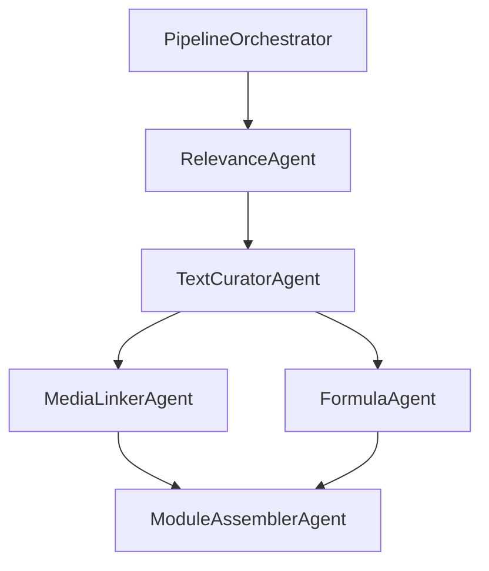

# Biology Pipeline v2 — Design Spec

**Status:** Revised (alignment + relevance correction)  
**Date:** 2026-05-16  
**Branch context:** Evolves `biology-content-creation` / `biology-multi-agent`  
**Region:** AWS `us-east-2` ([console](https://us-east-2.console.aws.amazon.com/console/home?region=us-east-2))

---

## 1. Goals

1. **Relevance filtering after vector search** — For each curriculum subtopic, retrieve top-10 similar chunks via pgvector, then run an LLM agent per chunk to decide relevance and extract the teachable excerpt. Only excerpts feed curation.
2. **Optional global enrichment** — Fix extraction errors, catalog formulas and images per chunk (separate from relevance).
3. **Prompt-building pipeline** — Offline lab to improve curation prompts on a fixed golden set.
4. **Layered LLM judges** — Validate extraction quality (optional), relevance filter output, and UDL on curated modules.

**Decisions locked:**

| Decision | Choice |
|----------|--------|
| Curriculum↔textbook link | **pgvector cosine similarity only** — no functional subtopic link in JSON; `textbook_chapters` / OpenStax URLs are metadata only |
| Retrieval depth | **Top 10** chunks per unit (`ALIGNMENT_TOP_K=10`) |
| Relevance agent | **Per unit × each of top-10 chunks** — `relevant: false` or `excerpt` text |
| Global enrichment | **Optional** phase (`enrich_global`) — repair, formulas, image catalog; not required for relevance |
| AWS deployment | **Hybrid** — Docker Postgres + pgvector for dev; S3 + DynamoDB + small RDS in `us-east-2` for prod |
| Prompt lab golden set | **3 units**, Theme 1 Topic 1 |
| Image sources (MediaLinker) | **B** — textbook S3 extract first; **OpenStax web fetch** when no suitable extract match |
| Formula representation | **LaTeX canonical** — `math` vs `chemistry` (`\ce{}`); render with **KaTeX** (+ mhchem) in app |
| Pipeline agents | **Orchestrator** dispatches registered **sub-agents** (relevance, text, media, formula, assembler) |

---

## 2. How alignment works today (baseline)

Implementation: `src/ibrary/alignment/aligner.py`, `embedder.py`.

1. **Chunk embeddings** are built from `title` + `learning_objectives` + `summary` — **not** full chunk body text.
2. **Query embedding** is built from curriculum unit: `topic` + `content_text` (subtopic) + performance objectives.
3. **Postgres pgvector** returns top-k chunks by cosine distance (`<=>` operator).
4. Default k is **2** today; v2 changes default to **10**.
5. Matches below `ALIGNMENT_CONFIDENCE_THRESHOLD` get `needs_review: true` but curation v1 may still use them.

**There is no separate “link subtopic to textbook” step.** Similarity scores are hints only; the **RelevanceScorer** is the real gate before curation.

### 2.1 Known limitation (future improvement)

Because search embeddings omit full body text, top-10 may miss good chunks or rank noisy ones. A follow-up task may add **full-content embeddings** without changing the relevance-agent contract.

---

## 3. Pipeline overview (v2)

### 3.1 Core path (required)

```
extract
  → validate
  → align              # pgvector top 10 per curriculum unit
  → filter_relevance   # LLM per (unit, chunk): relevant? excerpt?
  → curate             # RAG context = excerpts only
  → judge_all
  → publish
```

### 3.2 Optional path

```
extract → enrich_global → validate → align → filter_relevance → …
```

`enrich_global` runs once per `chunk_id` (repair, formulas, image alt text). Curation prefers `repaired_content` when present.

### 3.3 Offline

```
prompt_lab ──► prompt_version → curate / judge
```

---

## 4. Step: `align` (unchanged mechanism, new default k)

| Input | Output |
|-------|--------|
| `ValidatedCurriculum.units` | `curriculum_textbook_alignment.json` |

Per unit, `matches[]` contains up to **10** entries:

```json
{
  "chunk_id": "bio2e_ch1_sec2",
  "score": 0.82,
  "title": "...",
  "needs_review": false
}
```

**Config:** `ALIGNMENT_TOP_K=10` in `.env.example`.

---

## 5. Step: `filter_relevance` (RelevanceScorer)

### 5.1 Purpose

Turn “these 10 chunks are somewhat similar” into “here is the exact text to teach this subtopic.”

### 5.2 Per-call inputs

- Curriculum: `curriculum_unit_id`, `content_text` (subtopic), `topic`, performance objectives
- Chunk: `chunk_id`, embedding `score`, **full** `content` from `textbook_chunks` (use `repaired_content` if `enrich_global` ran)
- Optional: chunk `title`, alignment `needs_review` flag (informational only — **do not skip** low-score chunks; let the agent say not relevant)

### 5.3 Per-call outputs

```json
{
  "chunk_id": "bio2e_ch3_sec2",
  "relevant": true,
  "excerpt": "Plants and animals differ in …",
  "rationale": "Paragraphs 2–4 address plant vs animal differences.",
  "confidence": 8.5
}
```

or

```json
{
  "chunk_id": "bio2e_ch5_sec1",
  "relevant": false,
  "rationale": "Chunk is about viruses; subtopic is plant vs animal differences."
}
```

### 5.4 Orchestration

For each curriculum unit in scope:

1. Read `matches` from alignment (up to 10 `chunk_id`s).
2. Fetch full chunk rows from Postgres.
3. Call RelevanceScorer once per chunk (parallelism optional; batch by cost).
4. Persist results; build per-unit excerpt list for curation.

**Cost:** ~10 LLM calls per subtopic (use `OPENAI_ENRICHMENT_MODEL=gpt-4o-mini` or similar).

### 5.5 Storage

| Field | Postgres `chunk_relevance` | File backup |
|-------|--------------------------|-------------|
| PK | `(curriculum_unit_id, chunk_id)` | `chunk_relevance.json` in biology data dir |
| `relevant` | boolean | |
| `excerpt` | text, nullable | |
| `embedding_score` | float | from align step |
| `confidence` | float | agent self-score |
| `rationale` | text | |
| `agent_version` | string | e.g. `relevance-v1` |

DynamoDB `ChunkRelevance` optional mirror for AWS-only deploys.

### 5.6 Curation input (text phase)

After `filter_relevance`, the text curator receives **excerpt strings only** (not full chunks). See **§6** for how text + images are assembled into a display-ready module.

---

## 6. Curation — text, media, and display format

### 6.1 Today (v1 gaps)

| What exists | Gap |
|-------------|-----|
| `CuratedModule.curated_content` — Markdown string | App cannot render real images; only prose descriptions of figures |
| `CuratedModule.images: list[ImageRef]` | Schema exists but **never populated** by `curate_unit()` |
| `textbook_images` + S3 `textbook-images/` from `extract` | Not linked into curated modules |
| DynamoDB `publish_module` | Writes `curated_content_md` only — **no images** |
| Prompts | Ask for alt text **inside** Markdown — no asset IDs or URLs |

Curation today = **one LLM call → Markdown text**. We need a **two-agent curate step** + a **structured display format**.

### 6.2 Curation pipeline (v2)



| Step | Sub-agent | Input | Output |
|------|-----------|-------|--------|
| 1 | **TextCuratorAgent** | Subtopic, objectives, activities, **excerpts** | `content_blocks` + `image_placeholder` + **`formula_placeholder`** blocks |
| 2a | **MediaLinkerAgent** | Placeholders, chunk IDs, OpenStax URLs | `assets[]` + `image` blocks |
| 2b | **FormulaAgent** | Formula placeholders, excerpts, chunk IDs, optional formula catalog | `formulas[]` + `formula` blocks |
| 3 | **ModuleAssemblerAgent** | Blocks + assets + formulas + metadata | `LearningModule` v1 JSON |

**TextCurator** does not resolve binaries or LaTeX—it only marks *where* figures and equations belong. **MediaLinker** and **FormulaAgent** run in parallel after TextCurator, then Assembler merges.

See **§7** for orchestrator contract and formula representation.

### 6.3 MediaLinker — sources and rules (decision **B**)

**Resolution order per `image_placeholder`:**

```text
1. Textbook extract (PDF → S3 textbook-images/)
2. OpenStax web (curriculum page URL → download figure → S3 curated-assets/)
3. Text-only fallback (paragraph with description; no asset)
```

#### Source 1: Textbook extract

- Query `textbook_images` WHERE `chunk_id` IN (relevance excerpt chunk IDs).
- LLM ranks candidates against `placeholder.intent` + `search_hints`.
- Copy binary from `textbook-images/{image_id}.{ext}` → `curated-assets/{unit_id}/{asset_id}.ext`.
- Asset field: `"source": "textbook"`.

#### Source 2: OpenStax web (fallback)

Triggered when step 1 finds **no** candidate with confidence ≥ threshold (config: `MEDIA_TEXTBOOK_MIN_CONFIDENCE=0.6`).

- **Page URL** from curriculum topic: `textbook_openstax_links[]` on the matching `CurriculumTopic` (same `theme_number` + `topic_number` as the unit).
- **`openstax_fetcher`** module:
  1. HTTP GET the OpenStax page (cache response by URL in S3 `pipeline/openstax-cache/` or Postgres).
  2. Parse HTML for `<figure>` / `` associated with captions matching `search_hints` (BeautifulSoup + optional vision confirm).
  3. Download image from OpenStax CDN URL (`https://assets.openstax.org/...` or page-relative src).
  4. Upload to `curated-assets/{unit_id}/{asset_id}.ext`.
  5. Set `license: "CC BY 4.0 OpenStax"`, `attribution_url` = page URL, `source: "openstax_web"`, `source_page_url`.
- **Rate limit:** max 1 page fetch per unit per run; reuse cache across units sharing the same topic link.
- **Legal:** store license + attribution on every web-sourced asset; do not hot-link CDN in production (copy to our S3).

Example asset:

```json
{
  "asset_id": "asset_002",
  "source": "openstax_web",
  "source_page_url": "https://openstax.org/books/biology-2e/pages/1-1-recognizing-living-things",
  "original_image_url": "https://assets.openstax.org/.../figure1.jpg",
  "s3_url": "s3://ibrary-content/curated-assets/.../asset_002.jpg",
  "caption": "Figure 1.3 …",
  "alt_text": "…",
  "license": "CC BY 4.0 OpenStax"
}
```

#### Source 3: Fallback

- Replace `image_placeholder` with `paragraph` describing the figure in words (UDL).

**Rules (all sources):**

- Every image asset MUST have `alt_text` and `license`.
- Max **5 images per module** (`CURATION_MAX_IMAGES=5`).
- All binaries in **`curated-assets/`** for serving (not transient textbook paths).
- Log `media_resolution.json` per unit: placeholder_id → source used (`textbook` | `openstax_web` | `text_fallback`).

### 6.4 Display format: `LearningModule` v1

Apps render from **`content_blocks` + `assets`**, not raw Markdown alone.

```json
{
  "format_version": "learning-module-v1",
  "curriculum_unit_id": "bio_sss1_theme1_topic1_content0",
  "metadata": {
    "title": "Characteristics of Living Things",
    "class": "SSS 1",
    "theme": "Organisation Of Life",
    "theme_number": 1,
    "topic_number": 1,
    "subtopic": "Characteristics of living things",
    "learning_objectives": ["..."],
    "key_takeaways": ["..."],
    "glossary_terms": { "metabolism": "..." },
    "student_activities": ["..."],
    "teacher_activities": ["..."],
    "accessibility_checklist": ["..."],
    "textbook_chunk_refs": ["bio2e_ch1_sec1"],
    "prompt_version": "v1.4:abc12345",
    "model_version": "gpt-5.1",
    "status": "draft"
  },
  "assets": [
    {
      "asset_id": "asset_001",
      "source": "textbook",
      "image_id": "bio2e_p012_img03",
      "chunk_id": "bio2e_ch1_sec1",
      "s3_url": "s3://ibrary-content/curated-assets/bio_sss1_theme1_topic1_content0/asset_001.png",
      "cdn_url": null,
      "caption": "Figure 1.2 …",
      "alt_text": "Diagram showing …",
      "license": "CC BY 4.0 OpenStax",
      "attribution_url": "https://openstax.org/books/biology-2e/pages/1-1-recognizing-living-things"
    }
  ],
  "content_blocks": [
    { "id": "b1", "type": "heading", "level": 2, "text": "What makes something alive?" },
    { "id": "b2", "type": "paragraph", "text": "Living things share several characteristics…" },
    {
      "id": "b3",
      "type": "image",
      "asset_id": "asset_001",
      "placement": "inline"
    },
    { "id": "b4", "type": "callout", "variant": "udl_tip", "text": "Try text-to-speech for this section." },
    { "id": "b5", "type": "heading", "level": 3, "text": "Accessibility notes" },
    { "id": "b6", "type": "list", "style": "bullet", "items": ["…"] }
  ],
  "curated_content_md": "# Optional legacy export\n\n…"
}
```

**Block types (v1):**

| `type` | Purpose |
|--------|---------|
| `heading` | `level` 2–4 |
| `paragraph` | Body text |
| `list` | `style`: `bullet` \| `numbered` |
| `image` | `asset_id` → `assets[]` |
| `image_placeholder` | TextCurator output; MediaLinker replaces with `image` or `paragraph` |
| `formula` | `formula_id` → `formulas[]`; `display`: `inline` \| `block` |
| `formula_placeholder` | TextCurator output; FormulaAgent replaces with `formula` or plain `paragraph` |
| `callout` | `variant`: `udl_tip` \| `warning` \| `example` |
| `glossary` | Optional inline term list (or keep terms only in metadata) |

**`formulas[]` entry (parallel to `assets[]`):**

```json
{
  "formula_id": "f001",
  "kind": "chemistry",
  "latex": "\\ce{H2O}",
  "plain_text": "H2O",
  "spoken_text": "H two O",
  "source": "extracted",
  "chunk_id": "bio2e_ch2_sec3",
  "s3_key": "formulas/bio2e_ch2_sec3/f001.tex",
  "confidence": 0.92
}
```

```json
{
  "formula_id": "f002",
  "kind": "math",
  "latex": "E = mc^2",
  "plain_text": "E equals m c squared",
  "source": "generated",
  "confidence": 0.88
}
```

| `kind` | LaTeX convention | Biology examples |
|--------|------------------|------------------|
| `chemistry` | `\ce{...}` (mhchem) | `\ce{H2O}`, `\ce{CO2}`, `\ce{C6H12O12}` |
| `math` | standard LaTeX | ratios, `%`, simple algebra, scientific notation `6.02 \times 10^{23}` |

**Frontend rendering:** KaTeX with **mhchem extension** for chemistry; `plain_text` / `spoken_text` always shown for screen readers (aria-label or adjacent sr-only span). Markdown export: inline `$...$` / block `$$...$$` derived from `latex` at assemble time.

**Frontend rendering (pseudo):**

```text
for block in content_blocks:
  if block.type == "image":
    render <figure src={assets[block.asset_id].cdn_url} alt={...} />
  elif block.type == "formula":
    render <KaTeX math={formulas[block.formula_id].latex} chemistry={kind==chemistry} />
    render <span class="sr-only">{formulas[block.formula_id].spoken_text}</span>
  elif block.type == "paragraph":
    render <p>{block.text}</p>
```

### 6.5 Storage mapping

| Piece | Where |
|-------|--------|
| Full `LearningModule` JSON | Postgres `curated_content.content_json` (new column) + `curated_content.json` file |
| Image binaries | S3 `curated-assets/{unit_id}/{asset_id}.ext` |
| Legacy Markdown | `curated_content_md` — generated from blocks for search/API fallback |
| Published copy | DynamoDB SUBTOPIC item: `content_blocks` (JSON string), `assets` (JSON string), `curated_content_md` |

### 6.6 Prompt changes

**TextCurator** JSON keys add:

- `content_blocks` — array (no binary data)
- `image_placeholders` — optional list `{ block_id, intent, search_hints }` e.g. "diagram of cell levels"

**MediaLinker** JSON keys:

- `assets[]`
- `block_patches` — map `block_id` → `{ type: "image", asset_id }` or remove placeholder

### 6.7 Judges

- **UDL judge** — scores module including: every `image` block has `alt_text`; no image-only meaning without text.
- **Media judge** (optional) — asset matches subtopic and placeholder intent.
- **Formula judge** (optional) — LaTeX parses; chemistry/math kind correct; alt text present.

---

## 7. Pipeline orchestrator and sub-agents

### 7.1 Two “orchestrator” concepts

| Name | Role |
|------|------|
| **Cursor Orchestrator** | Human workflow in `docs/MULTI_AGENT_WORKFLOW.md` (plan, build, review) |
| **PipelineOrchestrator** | Code in `src/ibrary/pipeline/orchestrator.py` — runs pipeline steps and **calls sub-agents** with typed inputs/outputs |

This section defines **PipelineOrchestrator** and pipeline sub-agents only.

**Implementation files:**

| File | Role |
|------|------|
| `src/ibrary/pipeline/biology_subagents.py` | Sub-agent classes + registry |
| `src/ibrary/pipeline/orchestrator.py` | Native DAG runner (**default**) |
| `src/ibrary/pipeline/orchestrator_langgraph.py` | Optional LangGraph backend |
| `docs/BIOLOGY_PIPELINE_ORCHESTRATOR.md` | Framework comparison + usage |

### 7.2 Sub-agent registry

Each sub-agent implements a common interface:

```python
class PipelineSubAgent(Protocol):
    name: str
    def run(self, ctx: PipelineContext) -> PipelineContext: ...
```

| Sub-agent | Step(s) | Callable when |
|-----------|---------|----------------|
| `RelevanceAgent` | `filter_relevance` | After `align` |
| `TextCuratorAgent` | `curate` (phase 1) | After relevance |
| `MediaLinkerAgent` | `curate` (phase 2a) | After TextCurator |
| `FormulaAgent` | `curate` (phase 2b) | After TextCurator (parallel with MediaLinker) |
| `ModuleAssemblerAgent` | `curate` (phase 3) | After media + formula |
| `ContentRepairAgent` | `enrich_global` (optional) | After `extract` |
| `ImageCatalogAgent` | `enrich_global` (optional) | After `extract` |

`PipelineOrchestrator.run_unit(unit_id)` for curation:

```text
ctx = load_relevance_excerpts(unit_id)
ctx = TextCuratorAgent.run(ctx)
ctx = parallel(MediaLinkerAgent.run(ctx), FormulaAgent.run(ctx))
ctx = ModuleAssemblerAgent.run(ctx)
save LearningModule
```

### 7.3 FormulaAgent (decision locked)

**Goal:** Resolve every `formula_placeholder` into a stored LaTeX entry and a `formula` content block.

**Inputs:**

- `formula_placeholder` blocks from TextCurator (`intent`, e.g. "photosynthesis equation", `plain_hint`: "CO2 + H2O → glucose")
- Relevance **excerpts** + `chunk_id`s
- Optional **formula catalog** from chunk-level scan (`formulas` table + S3 `.tex` from `enrich_global`)
- Equation **images** in `textbook_images` on those chunks (vision path)

**Resolution order per placeholder:**

```text
1. Catalog match — existing formula row on same chunk_id / matching plain_hint
2. Text extract — LLM converts plain math/chem in excerpt to LaTeX (kind math|chemistry)
3. Vision — crop equation image from PDF extract; vision → LaTeX
4. Generate — LLM generates standard form for well-known intent (e.g. photosynthesis) with confidence flag
5. Fallback — paragraph with plain_text only (no formula block)
```

**Outputs:**

- `formulas[]` on `LearningModule`
- Patched `content_blocks` (`formula_placeholder` → `formula` or `paragraph`)
- `formula_resolution.json` per unit (audit trail, like `media_resolution.json`)

**Rules:**

- Never embed raw subscripts in paragraph text (`H2O`) when a `formula` block exists—use LaTeX + `plain_text`.
- Validate LaTeX with KaTeX parser in Assembler; on failure → fallback to `plain_text` paragraph.
- Biology v1: prioritize **chemistry** (`\ce{}`) and **simple math**; skip complex derivations unless in excerpt.

### 7.4 TextCurator + FormulaAgent handoff

TextCurator prompt must:

- Emit `formula_placeholder` where equations appear or are taught—not inline Unicode subscripts.
- Provide `intent` + `plain_hint` for each placeholder.

Example placeholder block:

```json
{
  "id": "b7",
  "type": "formula_placeholder",
  "display": "block",
  "intent": "photosynthesis overall equation",
  "plain_hint": "carbon dioxide + water → glucose + oxygen"
}
```

### 7.5 Optional: FormulaCatalog pass (`enrich_global`)

Chunk-level scan (can run before curation) populates `formulas` table from PDF text + figure crops. **FormulaAgent** consults catalog first to avoid duplicate LLM/vision calls. Not required for v2 MVP if FormulaAgent runs full resolution order at curate time.

---

## 8. Optional: `enrich_global`

Runs once per `chunk_id` after `extract`. Idempotent on `content_hash`.

| Agent | Output |
|-------|--------|
| **ContentRepair** | `repaired_content`, `extraction_quality_score` |
| **FormulaCatalogAgent** | Chunk-level LaTeX in S3; `formulas` table (feeds FormulaAgent) |
| **ImageCatalog** | `alt_text` / caption on `textbook_images` |

Relevance agent reads `repaired_content` when available. ImageCatalog alt text improves MediaLinker step 1.

---

## 9. AWS data stores (`us-east-2`)

| Store | Contents | When |
|-------|----------|------|
| **S3** `textbook-images/`, `formulas/`, `pipeline/` | Blobs + manifests | extract / enrich_global |
| **Postgres** | chunks, embeddings, **chunk_relevance**, curated drafts, scores | all steps |
| **DynamoDB** `ChunkRelevance` | optional mirror of relevance rows | filter_relevance |
| **DynamoDB** `CuratedContent` | published modules | publish |

**Cost controls:** `gpt-4o-mini` for relevance; `--curate-unit` for partial runs; cache relevance by `(unit_id, chunk_id, content_hash)`.

---

## 10. Prompt-building pipeline

Unchanged intent; golden set (3 units):

| `curriculum_unit_id` | Subtopic |
|----------------------|----------|
| `bio_sss1_theme1_topic1_content0` | Characteristics of living things |
| `bio_sss1_theme1_topic1_content1` | Differences between plants and animals |
| `bio_sss1_theme1_topic1_content2` | Levels of organization of life |

Lab flow: `align` → `filter_relevance` → `curate` (golden units only) → UDL judge → compare prompt versions.

---

## 11. Layered LLM judges (`ibrary.judging`)

**Module:** `src/ibrary/judging/` — independent of curation and `prompt_improvement`.

The UDL judge is **content-first**: call it whenever body text is available, not only for full `CuratedModule` objects or prompt A/B tests.

| API | When to use |
|-----|-------------|
| `evaluate_text(content, subtopic=..., ...)` | Minimal call — only `content` required |
| `evaluate_content(SubtopicJudgeInput)` | Full metadata (objectives, activities, glossary, …) |
| `evaluate_subtopic(CuratedModule)` | After curation / pipeline `judge` step |
| `prompt_improvement.compare_*` | Uses same `evaluate_content` for baseline vs candidate |

Rubric: all CAST UDL v3.0 checkpoints from `data/docs/udlg3-graphicorganizer-digital-numbers-a11y.pdf`.

| Layer | When | Validates |
|-------|------|-----------|
| **Extraction judge** | After optional `enrich_global` | Repair quality (sampled) |
| **Relevance judge** | After `filter_relevance` | Agent excerpts vs subtopic (audit) |
| **UDL judge** | Any time text exists | `evaluate_text` / `evaluate_content` |

Low relevance-judge score on a kept excerpt → flag unit `needs_review`.

---

## 12. Schema additions

**Postgres:**

```text
chunk_relevance (
  curriculum_unit_id, chunk_id,  -- unique
  relevant BOOLEAN NOT NULL,
  excerpt TEXT,
  embedding_score FLOAT,
  confidence FLOAT,
  rationale TEXT,
  agent_version VARCHAR,
  created_at, updated_at
)

curated_content.content_json JSONB  -- full LearningModule v1
curated_content.assets_json JSONB   -- optional denormalized assets[] for queries

formulas (
  formula_id PK,
  chunk_id FK,
  kind VARCHAR,  -- math | chemistry
  latex TEXT NOT NULL,
  plain_text TEXT,
  spoken_text TEXT,
  s3_key VARCHAR,
  content_hash VARCHAR,
  source VARCHAR,  -- extracted | generated | catalog
  confidence FLOAT
)
```

Optional on `textbook_chunks`: `repaired_content`, `extraction_quality_score` (if enrich_global enabled).

**S3 prefixes:** `curated-assets/{unit_id}/`, `formulas/{chunk_id}/{formula_id}.tex`

**Config:**

```text
ALIGNMENT_TOP_K=10
OPENAI_RELEVANCE_MODEL=gpt-4o-mini
CURATION_MAX_IMAGES=5
MEDIA_TEXTBOOK_MIN_CONFIDENCE=0.6
OPENSTAX_FETCH_TIMEOUT_SEC=30
OPENSTAX_CACHE_ENABLED=true
```

---

## 13. Success criteria

1. Each unit retrieves 10 pgvector matches; relevance agent runs on all 10.
2. Curation context contains **only excerpts** from relevant chunks; token count drops vs v1 on golden 3 units.
3. Irrelevant high-similarity chunks are excluded (manual spot-check on topic 1 units).
4. Prompt lab runs end-to-end on golden set.
5. Optional: `enrich_global` improves excerpt quality on OCR-noisy chunks.
6. Curated modules include ≥1 real image block with S3 URL + alt text when textbook figures exist for relevant chunks.
7. Formulas render from LaTeX (`\ce{}` / math); each has `plain_text` + `spoken_text` for accessibility.
8. PipelineOrchestrator runs TextCurator → (MediaLinker ∥ FormulaAgent) → Assembler per unit.

---

## 14. Implementation order

1. `ALIGNMENT_TOP_K=10` + `filter_relevance` + Postgres migration.
2. `LearningModule` schema (`assets` + `formulas` + block types).
3. `PipelineOrchestrator` + sub-agent interfaces.
4. TextCurator + MediaLinker (B) + **FormulaAgent** + Assembler.
5. DynamoDB publish (`content_blocks`, `assets`, `formulas`).
6. Judges + prompt lab.
7. Optional `enrich_global` (FormulaCatalogAgent, ImageCatalogAgent).
8. Docs + KaTeX render notes for frontend; optional full-content embeddings spike.

---

## References

- Alignment: `src/ibrary/alignment/aligner.py`
- Curation: `src/ibrary/curation/curation_service.py`
- Plan: `docs/superpowers/plans/2026-05-16-biology-pipeline-v2.md`
- Multi-agent workflow: `docs/MULTI_AGENT_WORKFLOW.md`
